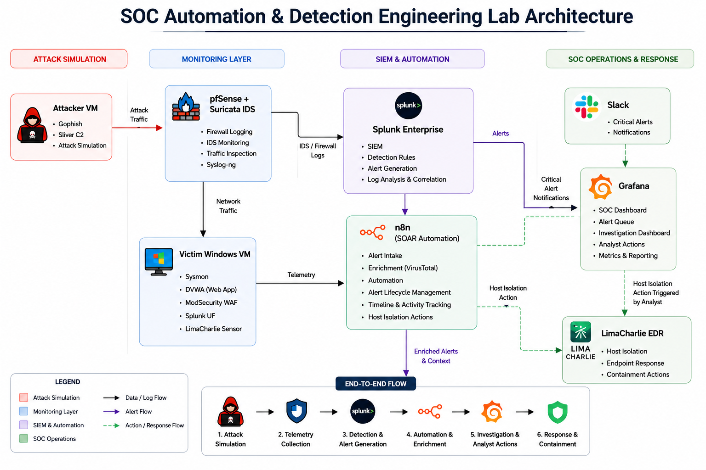
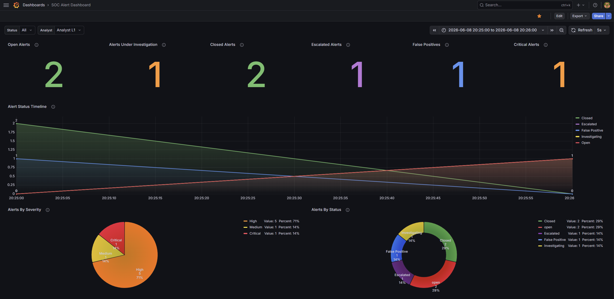
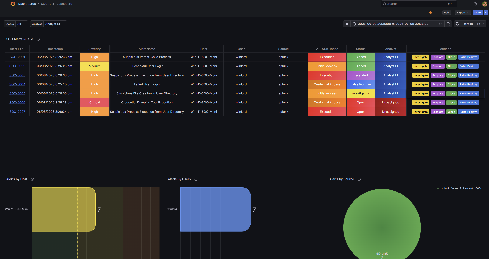
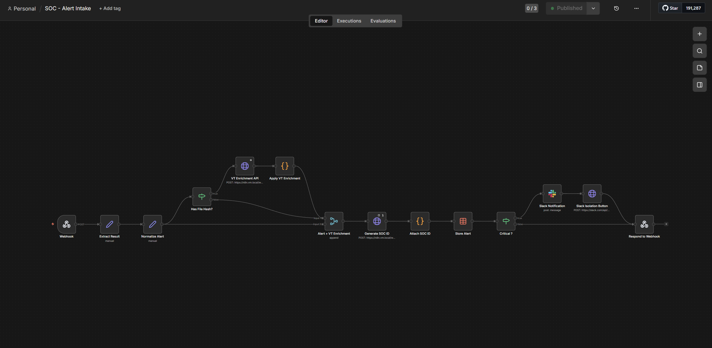
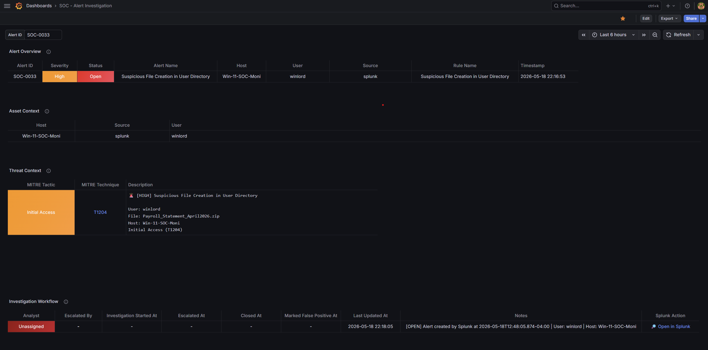
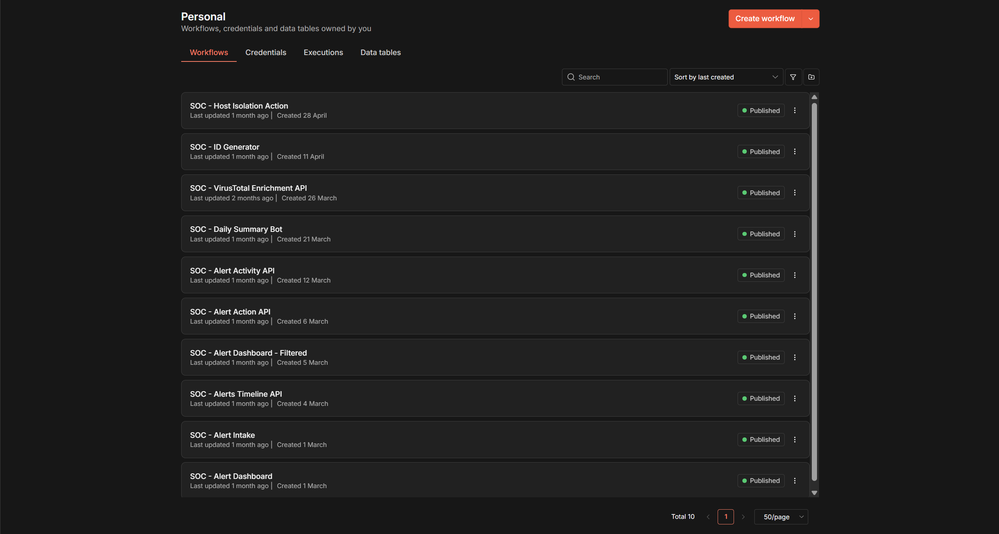

# SOC Automation & Detection Engineering Lab



SOC Platform


Detection & Threat Hunting


Attack Simulation


Infrastructure


Repository


A comprehensive Security Operations Center (SOC) simulation environment designed to emulate real-world detection engineering, security monitoring, incident response, threat hunting, and SOAR-style automation workflows.

This project integrates multiple security technologies to simulate the complete attack-to-response lifecycle, from attack execution and telemetry collection to detection, enrichment, investigation, containment, and response.

---

## Table of Contents

* [Lab Statistics](#lab-statistics)
* [Documentation](#documentation)
* [Key Features](#key-features)
* [Architecture Overview](#architecture-overview)
* [Telemetry Pipeline](#telemetry-pipeline)
* [Lab Infrastructure](#lab-infrastructure)
* [Attack Simulation Coverage](#attack-simulation-coverage)
* [Splunk Detection Engineering](#splunk-detection-engineering)
* [n8n SOAR Automation](#n8n-soar-automation)
* [Grafana SOC Dashboards](#grafana-soc-dashboards)
* [Incident Response Workflow](#incident-response-workflow)
* [MITRE ATT&CK Mapping](#mitre-attck-mapping)
* [Project Achievements](#project-achievements)
* [Platform Screenshots](#platform-screenshots)
* [Lessons Learned](#lessons-learned)
* [Repository Structure](#repository-structure)
* [Future Improvements](#future-improvements)
* [Related Writeups](#related-writeups)
* [Disclaimer](#disclaimer)
* [Author](#author)

---

# Lab Statistics

| Metric                             | Value    |
| ---------------------------------- | -------- |
| Splunk Indexes                     | 5        |
| Detection Rules                    | 20+      |
| n8n SOAR Workflows                 | 10       |
| Grafana Dashboards                 | 2        |
| Dashboard Panels                   | 35+      |
| Telemetry Sources                  | 5+       |
| Security Tools Integrated          | 12+      |
| Attack Simulations                 | Multiple |
| MITRE ATT&CK Techniques            | 10+      |
| End-to-End Investigation Workflows | Complete |

---

# Documentation

| Section       | Description                                             |
| ------------- | ------------------------------------------------------- |
| docs/         | Architecture, telemetry, workflows, and lessons learned |
| detections/   | Detection engineering documentation and SPL             |
| workflows/    | n8n workflow documentation and exports                  |
| dashboards/   | Grafana dashboard exports                               |
| phishing-lab/ | Dedicated phishing simulation project                   |
| architecture/ | Architecture and telemetry flow diagrams                |

---

# Key Features

## Detection Engineering

* Custom Splunk detection rules
* MITRE ATT&CK aligned detections
* Endpoint monitoring with Sysmon
* Network monitoring with Suricata
* Web attack detection with ModSecurity and OWASP CRS
* Alert normalization and enrichment

## Security Monitoring

* Centralized log collection using Splunk
* Endpoint telemetry analysis
* Network traffic monitoring
* Web application security monitoring
* Real-time security dashboards

## SOAR Automation

* Automated alert processing
* VirusTotal threat intelligence enrichment
* Alert lifecycle management
* Investigation timeline tracking
* Host isolation using LimaCharlie
* Daily SOC reporting

## Incident Response

* Alert triage workflows
* Investigation dashboards
* Analyst activity tracking
* Automated containment actions
* Response documentation

---

# Architecture Overview

The lab simulates a modern SOC environment composed of multiple security layers.

## Monitoring Layer

* Splunk Enterprise
* Grafana

## Automation Layer

* n8n
* VirusTotal
* Slack

## Endpoint Security

* Sysmon
* Sysmon-ng
* LimaCharlie EDR
* Splunk Universal Forwarder

## Network Security

* pfSense
* Suricata IDS

## Web Security

* DVWA
* ModSecurity
* OWASP Core Rule Set

## Attack Simulation

* Gophish
* Sliver C2
* Netcat
* Custom Attack Tooling

Additional architecture documentation is available in:

- [Architecture Diagrams](architecture/)
- [Architecture Documentation](docs/architecture.md)

---

# Telemetry Pipeline

The lab collects telemetry from multiple sources and centralizes visibility within Splunk.

## Endpoint Telemetry

```text
Windows 11
 ├─ Sysmon
 ├─ Windows Event Logs
 ├─ LimaCharlie
 └─ Splunk Universal Forwarder
```

## Network Telemetry

```text
pfSense
 └─ Suricata IDS
```

## Web Telemetry

```text
DVWA
 └─ ModSecurity
     └─ OWASP CRS
```

## Processing Flow

```text
Telemetry Sources
        ↓
      Splunk
        ↓
 Custom Detections
        ↓
      n8n
        ↓
 Enrichment & Response
        ↓
     Grafana
```

Detailed telemetry documentation:

- [Telemetry Pipeline](docs/telemetry-pipeline.md)

---

# Lab Infrastructure

## Attacker System

Ubuntu Linux

Tools:

* Gophish
* Sliver C2
* Netcat
* Python HTTP Server

## Victim System

Windows 11

Installed Components:

* Sysmon
* LimaCharlie Sensor
* Splunk Universal Forwarder
* Thunderbird Mail Client

## Security Monitoring Stack

* Splunk Enterprise
* Grafana
* n8n
* VirusTotal
* Slack

## Network Security Stack

* pfSense
* Suricata IDS

## Web Security Stack

* DVWA
* ModSecurity
* OWASP CRS

---

# Attack Simulation Coverage

The lab simulates realistic attacker activity across multiple stages of an attack lifecycle.

## Initial Access

* Phishing Campaigns
* Malicious Attachments
* User Interaction

## Execution

* PowerShell Abuse
* Command Execution
* Malicious Process Launches

## Credential Access

* Mimikatz
* ProcDump
* LaZagne

## Discovery

* Host Enumeration
* Network Enumeration
* User Enumeration

## Web Attacks

* SQL Injection
* Cross-Site Scripting (XSS)
* Command Injection

## Exfiltration

* Netcat
* PowerShell
* Curl
* SCP

---

# Splunk Detection Engineering

## Windows Detections

* Failed User Login
* Successful User Login

## Network Detections

* Brute Force Detection
* Suspicious Network Connection

## Web Detections

* SQL Injection
* Cross-Site Scripting (XSS)
* Command Injection

## Sysmon Detections

* Credential Dumping Tool Execution
* Suspicious PowerShell Execution
* Suspicious Parent-Child Process Relationships
* Post-Exploitation Reconnaissance
* Data Exfiltration Activity

Detection documentation:

- [Detection Engineering Documentation](detections/)

---

# n8n SOAR Automation

| Workflow                         | Purpose                            |
| -------------------------------- | ---------------------------------- |
| SOC - ID Generator               | Generates unique alert identifiers |
| SOC - Alert Intake               | Processes incoming alerts          |
| SOC - VirusTotal Enrichment API  | Threat intelligence enrichment     |
| SOC - Host Isolation Action      | Endpoint containment               |
| SOC - Alert Activity API         | Analyst activity tracking          |
| SOC - Alerts Timeline API        | Investigation timelines            |
| SOC - Alert Action API           | Analyst actions                    |
| SOC - Alert Dashboard            | Dashboard data source              |
| SOC - Alert Dashboard - Filtered | Dashboard filtering                |
| SOC - Daily Summary Bot          | Daily reporting                    |

Workflow exports:

- [n8n Workflow Documentation](workflows/)

---

# Grafana SOC Dashboards

## SOC Alert Dashboard

Provides:

* Alert queue
* Severity tracking
* Alert metrics
* Alert lifecycle visibility
* Analyst performance metrics

## SOC Alert Investigation Dashboard

Provides:

* Alert overview
* Asset context
* Threat context
* Investigation workflow
* Timeline tracking
* SLA monitoring
* Resolution metrics

Dashboard exports:

- [Grafana Dashboard Documentation](dashboards/)

---

# Incident Response Workflow

```text
Detection
    ↓
Alert Intake
    ↓
Alert Enrichment
    ↓
SOC Dashboard
    ↓
Analyst Investigation
    ↓
Containment
    ↓
Recovery
    ↓
Closure
```

Detailed workflow documentation:

- [Incident Response Workflow](docs/incident-response-workflow.md)

---

# MITRE ATT&CK Mapping

| Detection                        | ATT&CK Technique |
| -------------------------------- | ---------------- |
| Credential Dumping               | T1003            |
| Suspicious PowerShell            | T1059.001        |
| Parent-Child Process Abuse       | T1059            |
| Post-Exploitation Reconnaissance | T1082            |
| Data Exfiltration                | T1041            |
| SQL Injection Detection          | T1190            |
| Cross-Site Scripting Detection   | T1059            |
| Command Injection Detection      | T1059            |
| Brute Force Detection            | T1110            |

---

# Project Achievements

* Built a complete SOC simulation environment
* Developed custom Splunk detection rules
* Implemented SOAR-style automation using n8n
* Integrated VirusTotal threat intelligence enrichment
* Created analyst-focused Grafana dashboards
* Implemented host isolation through LimaCharlie
* Simulated phishing campaigns using Gophish
* Simulated command-and-control activity using Sliver
* Built end-to-end attack detection workflows
* Mapped detections to MITRE ATT&CK techniques

---

# Platform Screenshots

## SOC Grafana Dashboard


## SOC Alert Queue


## SOC Alert Intake Workflow



## Alert Investigation Dashboard



## n8n SOAR Workflows



---

# Lessons Learned

* Effective detections require quality telemetry.
* Alert enrichment significantly improves investigation speed.
* Automation reduces repetitive analyst workload.
* Detection tuning is critical for reducing false positives.
* Security visibility improves when multiple telemetry sources are correlated.
* End-to-end attack simulations reveal gaps that isolated testing often misses.

- [Lessons Learned](docs/lessons-learned.md)

---

# Repository Structure

```text
soc-automation-detection-engineering-lab
├── architecture/
├── assets/
├── dashboards/
├── detections/
├── docs/
├── phishing-lab/
├── screenshots/
├── workflows/
└── README.md
```

---

# Future Improvements

* Additional Suricata detections
* Threat hunting dashboards
* Detection-as-Code implementation
* Expanded phishing simulations
* Malware analysis workflows
* Purple-team exercises
* Additional SOAR playbooks
* Additional threat intelligence integrations

---

# Related Writeups

## Medium Articles

* I Built a Phishing Lab to Finally Understand the Cyber Kill Chain
* Inside My Phishing Simulation Lab: Red Team Meets Blue Team

Additional project documentation:

- [Phishing Lab Documentation](phishing-lab/)

---

# Disclaimer

This project was created for educational and defensive security purposes only.

All attack simulations were conducted in an isolated lab environment owned and controlled by the author. No testing was performed against systems without authorization.

---

## Author

**Harikrishnan P**

Aspiring SOC Analyst focused on Detection Engineering, Security Monitoring, Incident Response, and Security Automation.

### Connect With Me

- GitHub: [Harikrishnan-P97](https://github.com/Harikrishnan-P97)
- LinkedIn: [Harikrishnan P](https://www.linkedin.com/in/harikrishnanp097/)
- Medium: [@harikrishnan.p097](https://medium.com/@harikrishnan.p097)

---

## Explore the Repository

| Section | Description |
|----------|-------------|
| [Docs](docs/) | Lab overview, architecture, telemetry pipeline, incident response workflow, lessons learned |
| [Detections](detections/) | Splunk detection engineering content and detection logic |
| [Workflows](workflows/) | n8n SOAR workflow exports and documentation |
| [Dashboards](dashboards/) | Grafana dashboard exports and dashboard documentation |
| [Phishing Lab](phishing-lab/) | End-to-end phishing simulation project and attack chain analysis |
| [Architecture](architecture/) | Architecture diagrams and telemetry flow diagrams |
